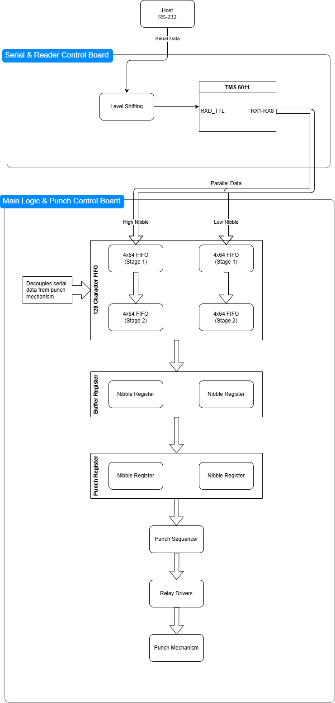

# SRP-3075 Main Logic and Punch Control

## Overview

This directory contains reverse-engineered schematics and supporting material for the Main Logic and Punch Control board used in the Data Specialties SRP-3075.

The Main Logic and Punch Control board is the central system board of the SRP-3075. It serves as the primary interconnection point for the machine's subsystems and is responsible for system coordination, punch data handling, punch control, front-panel operation, and parallel-interface functions.

The schematics were recreated through examination of an original SRP-3075. They are not original Data Specialties drawings.

## Function within the SRP-3075

Responsibility for machine operation is divided between this board and the Serial Interface and Reader Control board.

The Main Logic and Punch Control board is responsible for:

- System clock generation
- Power-on reset generation
- Front-panel controls and indicators
- Punch data buffering
- Punch sequencing
- Punch motor control
- Punch relay drive
- Punch stepper control
- Parallel-interface support
- System-level coordination
- Interconnection of the machine's assemblies

The Serial Interface and Reader Control board provides serial communications and reader-control functions, while this board provides the core machine-control functions required to operate the punch mechanism.

## System Architecture

The Main Logic and Punch Control board serves as the connectivity hub for the SRP-3075.

Major connections include:

- Serial Interface and Reader Control board
- Punch mechanism
- Front panel
- Power supply
- AC motor sensor
- Stepper motor
- Optional parallel-interface circuitry
- Optional low tape detection module (Option G)

Most machine control signals pass through this board.

## Data Flow

The punch datapath is shown below.

A received character passes through several stages before it reaches the punch mechanism:

1. The Serial Interface and Reader Control board converts incoming serial data into parallel character data.
2. The character enters the FIFO buffer.
3. The FIFO transfers the next available character into the Buffer Register.
4. The Buffer Register transfers the character into the Punch Register.
5. The Punch Sequencer coordinates the punch cycle.
6. Relay-driver circuitry energizes the appropriate punch channels.
7. The punch mechanism produces the corresponding tape pattern.

This staged approach allows serial reception, FIFO buffering, punch preparation, and mechanical punching to operate largely independently.

## FIFO Buffer

Received punch data is stored in a 128-character FIFO buffer.

The FIFO is implemented using four 3341 FIFO devices arranged as two cascaded paths:

- High nibble path
- Low nibble path

Each path uses two 64×4 FIFO devices connected in cascade, providing a total storage capacity of 128 punch characters.

The FIFO allows the machine to continue accepting serial data while the punch mechanism is operating or starting.

### FIFO Device Notes

The FIFO implementation uses Signetics 3341 PMOS FIFO memories.

Unlike later TTL memory devices, the 3341 requires:

- +5 V
- GND
- -12 V

This multi-supply requirement was not unusual for memory devices of the period.

Anyone investigating replacements should verify power-supply requirements carefully. Devices with similar functionality may not be electrically compatible even if they appear mechanically compatible.

## Buffer and Punch Registers

Two layers of registers exist between the FIFO and the punch mechanism:

### Buffer Register

The Buffer Register receives the next character from the FIFO and isolates FIFO timing from punch timing.

### Punch Register

The Punch Register contains the character currently being punched.

The punch-control logic operates from the Punch Register outputs rather than directly from FIFO data.

This separation allows the machine to prepare the next character while the current character is being processed.

## System Coordination

Several core machine functions originate on this board.

### System Clock

The main machine timing reference is generated on the Main Logic and Punch Control board and distributed to the remaining circuitry.

### Power-On Reset

The board generates the power-on initialization sequence that establishes a known machine state after power is applied.

### System Ready

Reset and timing circuitry produce the signals that indicate when normal machine operation may begin.

## Punch Control

Punch operation is coordinated by several dedicated subsystems.

### Punch Sequencer

The sequencer controls the order and timing of punch operations.

Responsibilities include:

- Character punching
- Sprocket punching
- Tape advance timing
- Coordination with motor synchronization circuitry

### AC Motor Synchronization

The punch mechanism contains an AC motor with a position sensor.

Synchronization circuitry monitors motor position and derives timing signals used by the punch-control logic.

The design includes:

- Sensor conditioning
- Missing-pulse detection
- Motor-speed monitoring
- Punch timing synchronization

### Stepper Drive

Dedicated circuitry controls tape advancement and punch positioning through the punch stepper subsystem.

### Relay Drivers

Relay-driver circuitry converts logic-level punch data into the power levels required by the punch mechanism.

Individual relay channels correspond to:

- Punch channels 1 through 8
- Sprocket channel (Relay/Punch 9)

## Front Panel Interface

The Main Logic and Punch Control board interfaces directly with the machine's controls and indicators.

Functions include:

- Reader control
- Punch control
- Remote-control enable
- Status indication
- Power indication

This board therefore forms the primary interface between the operator and the machine.

## Parallel-Interface Support

Evidence suggests that the Main Logic and Punch Control board was designed for use across multiple SRP-3075 variants.

The examined board contains populated circuitry associated with a parallel punch interface.

In the serial configuration this functionality is disabled by the `/SERIAL_DETECT` signal supplied by the Serial Interface and Reader Control board.

The corresponding reader-side parallel-interface circuitry is not populated on the examined board. An unpopulated DIP-14 footprint is present in this area.

These observations suggest that Data Specialties likely used a common logic board across multiple SRP-3075 configurations, with variant-specific functionality provided through different companion interface boards and selective component population.

This conclusion is based on observed hardware and should be considered an informed reconstruction rather than documented manufacturer information.

## Connectors

This board acts as the primary interconnection point for the system.

Connectors include:

- Power-supply interface
- Serial-board interface
- Front-panel interface
- Stepper-motor interface
- AC motor sensor interface
- Relay outputs
- Parallel-interface connections

The board distributes power, timing, status, and control signals among the machine's assemblies.

## Component Reference Designators

The original Main Logic and Punch Control board contained no component reference designators.

All component references shown in the reconstructed schematics were assigned during reverse engineering.

These assigned references are used consistently throughout:

- Schematics
- Netlists
- Component-location documentation
- Restoration notes

They are not original manufacturer designations.

## Repository Contents

This directory contains:

- KiCad project files
- Hierarchical KiCad schematics
- Generated netlists
- PDF schematic exports
- Component-location images

The KiCad schematics and netlists are the editable engineering sources.

The repository does not currently contain recreated PCB layouts. Any placeholder PCB files should not be interpreted as representations of the original board routing.

## Reverse-Engineering Notes

The schematics were recreated by:

- Component identification
- PCB tracing
- Connector reconstruction
- Signal tracing
- Functional analysis
- Comparison with available manufacturer documentation
- Cross-reference against the Serial Interface and Reader Control board and Power Supply schematics

Signal names were assigned or normalized where necessary to make the design understandable and maintainable.

The reverse engineering of this assembly is considered substantially complete.

## Accuracy and Open Questions

The schematics are believed to accurately represent the examined hardware.

Corrections may still be incorporated as restoration and functional testing continue.

Areas that may benefit from additional investigation include:

- Differences between production revisions
- Alternative interface-board configurations
- Factory-installed options
- Undocumented hardware modifications
 
No significant functional uncertainties are presently known.
 
## Safety
 
This board contains connections to:
 
- AC motor-control circuitry
- Relay-driver circuitry
- +24 V power circuitry
- External electromechanical assemblies
 
Disconnect power before servicing the machine and verify proper connector placement before reconnecting associated assemblies.
 
## License
 
This material is licensed under the terms provided in the ../LICENSE.
 
Manufacturer names, model numbers, and trademarks are used only for identification and historical documentation.
